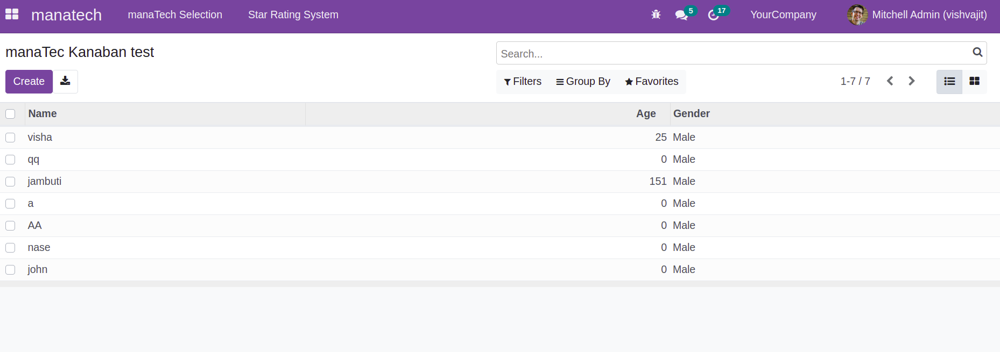
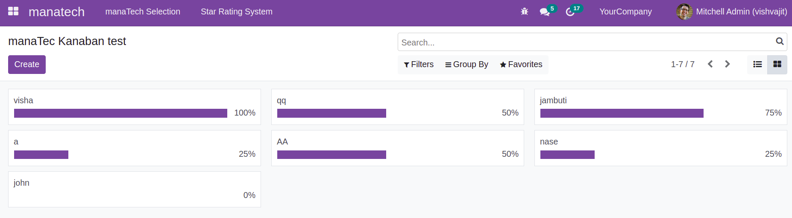
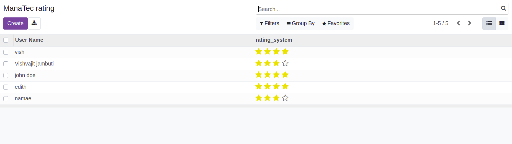
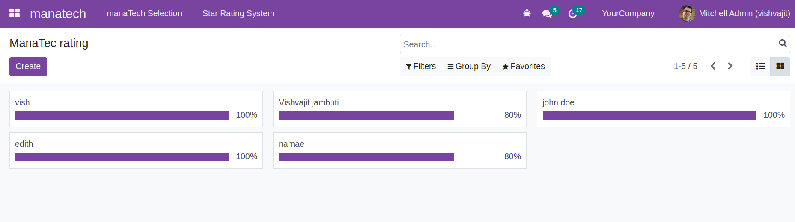

# # Odoo Module Installation Documentation

## Prerequisites

Odoo 15

## Installation Steps 

Follow these steps to install the module:

1. **Download the Module**:
    
    - Clone the modul in addons folder 

    - git clone https://github.com/vishvajitjambuti/Odoo_Modul_Test.git

2. **Login to Odoo**:

   - Log in to your Odoo instance with admin or superuser credentials.

3. **Install the Module**:

   - Go to `Apps` in your Odoo instance.
   - Click on the `Update Apps List` button to refresh the app list.
   - In the search bar, type the name of your module and press Enter.
   - Locate the module in the search results and click the `Install` button.

4. **Configuration**:

   - After installation, configure the module as required. Refer to the "Configuration" section for more details.

## Test Results 

### Test  List View(Selction) and kanban View(progress bar of the selection)

*List View for the user Selection*

*Kanban View for the user Selection progress bar*

*List View for the user Rating*

*Kanban View for the user rating progress bar*